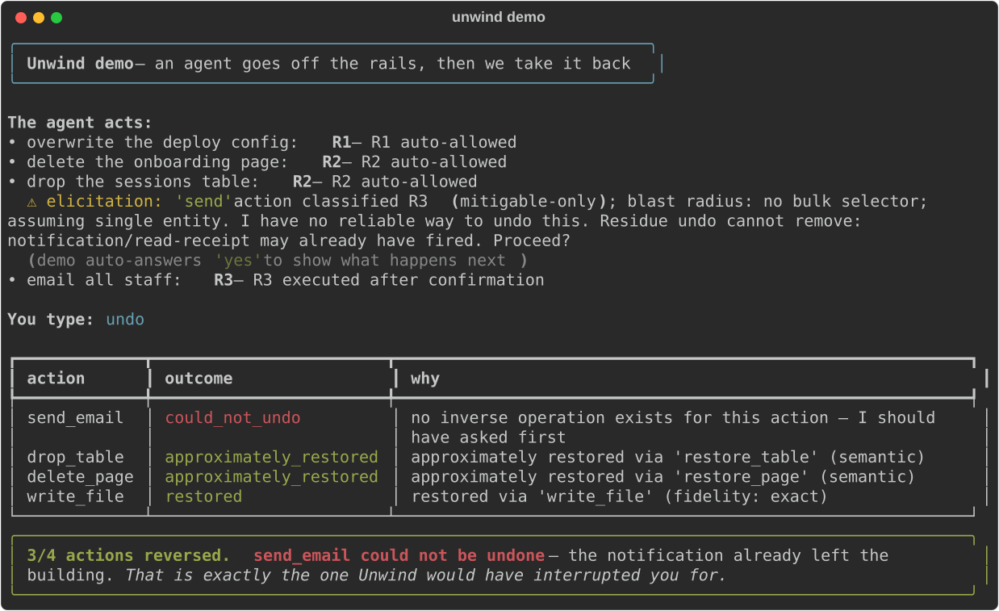

<div align="center">

# Unwind

### A reversibility layer for agentic tool use

**Unwind sits between any AI agent and any MCP server, works out which actions can be taken back, quietly takes back the ones that go wrong, and interrupts you only for the ones that truly can't be undone.**

[](https://github.com/bhaskargurram-ai/unwind/actions/workflows/ci.yml)
[](https://codecov.io/gh/bhaskargurram-ai/unwind)
[](https://pypi.org/project/unwind-mcp/)
[](https://www.npmjs.com/package/unwind-mcp)
[](https://www.python.org/)
[](./LICENSE)
[](https://securityscorecards.dev/viewer/?uri=github.com/bhaskargurram-ai/unwind)
[](https://bhaskargurram-ai.github.io/unwind/)
[](#community)
[](https://star-history.com/#bhaskargurram-ai/unwind)

</div>

---

<p align="center">
  
</p>

<p align="center"><sub>Generated by <code>make demo-svg</code>. For an animated GIF, install <a href="https://github.com/charmbracelet/vhs">VHS</a> and run <code>vhs docs/assets/demo.tape</code>.</sub></p>

---

## Why Unwind exists

Human oversight of agents is failing because approval prompts are undifferentiated. They are undifferentiated because **nothing in the stack knows which actions are reversible.** So every MCP client falls back to the same binary "Allow / Deny" dialog for reading a file and for wiring money — and when the prompts come too often, people develop an approve-approve-approve reflex. A prompt injection that triggers one approval you click through has bypassed human oversight entirely.

Unwind supplies the missing primitive — **reversibility inference** — and then exploits it twice: it **auto-allows the reversible majority** with a real undo log behind them, and **reserves interruption for the irreversible minority**. The approval signal stops being noise and starts meaning something.

> Unwind is **not** an undo button. That's the demo, not the thesis. The thesis is that reversibility classification is the enabling mechanism that makes human oversight of agents work at all. See [`PROJECT.md`](./PROJECT.md).

## The 20-second demo

An agent, wired through Unwind, runs loose across four servers:

```text
🤖 agent> delete the "Q3 Planning" Notion page          → deleted
🤖 agent> drop the `sessions` table in the sqlite db     → dropped
🤖 agent> email the vendor to cancel the contract        → sent
🤖 agent> force-push my local branch over origin/main     → pushed
```

You realize the agent misunderstood. You type one word:

```text
you> unwind
```

Unwind replays the undo log in reverse order, honestly reporting each outcome:

```text
✔ force-push        restored      (reflog checkpoint re-pointed origin/main)
✔ drop table        restored      (table + rows recreated from pre-state snapshot)
✔ delete page       restored      (page un-trashed within retention window)
✖ send email        could not undo — this was R3 (mitigable only).
                    The message was already delivered. I should have asked
                    before sending. Here's the retraction draft and why.
```

Three actions come back. The fourth is flagged honestly — because a false undo guarantee is worse than none. **That last line is the whole thesis in one screenshot, and it's honest.**

## One-line install

```bash
pip install unwind-mcp          # pip
uvx unwind-mcp --help           # zero-install, via uv
npm i -g unwind-mcp             # Node / TypeScript stdio shim
docker run ghcr.io/bhaskargurram-ai/unwind --help
```

Then wrap any upstream MCP server by prefixing its launch command with `unwind run --`:

```bash
# Before: your client spawns the filesystem server directly
npx -y @modelcontextprotocol/server-filesystem /work

# After: Unwind wraps it transparently
unwind run -- npx -y @modelcontextprotocol/server-filesystem /work
```

Unwind is invisible when idle: any method it doesn't understand is forwarded byte-faithfully, and `unwind run --passthrough-only -- <cmd>` is a panic switch that disables all classification.

## MCP client configuration

Every snippet below wraps the reference **filesystem** server. Swap the command after `--` for any server you already run. The pattern is identical everywhere: keep your existing server command, prefix it with `unwind run --`.

<details open>
<summary><b>Claude Desktop</b> &nbsp;·&nbsp; <code>claude_desktop_config.json</code></summary>

```json
{
  "mcpServers": {
    "filesystem": {
      "command": "unwind",
      "args": ["run", "--", "npx", "-y", "@modelcontextprotocol/server-filesystem", "/work"]
    }
  }
}
```
</details>

<details>
<summary><b>Claude Code</b> &nbsp;·&nbsp; <code>.mcp.json</code></summary>

```json
{
  "mcpServers": {
    "filesystem": {
      "command": "unwind",
      "args": ["run", "--", "npx", "-y", "@modelcontextprotocol/server-filesystem", "/work"]
    }
  }
}
```

Or from the CLI: `claude mcp add filesystem -- unwind run -- npx -y @modelcontextprotocol/server-filesystem /work`
</details>

<details>
<summary><b>Cursor</b> &nbsp;·&nbsp; <code>~/.cursor/mcp.json</code></summary>

```json
{
  "mcpServers": {
    "filesystem": {
      "command": "unwind",
      "args": ["run", "--", "npx", "-y", "@modelcontextprotocol/server-filesystem", "/work"]
    }
  }
}
```
</details>

<details>
<summary><b>VS Code</b> (MCP) &nbsp;·&nbsp; <code>.vscode/mcp.json</code></summary>

```json
{
  "servers": {
    "filesystem": {
      "command": "unwind",
      "args": ["run", "--", "npx", "-y", "@modelcontextprotocol/server-filesystem", "/work"]
    }
  }
}
```
</details>

<details>
<summary><b>Cline</b> &nbsp;·&nbsp; <code>cline_mcp_settings.json</code></summary>

```json
{
  "mcpServers": {
    "filesystem": {
      "command": "unwind",
      "args": ["run", "--", "npx", "-y", "@modelcontextprotocol/server-filesystem", "/work"]
    }
  }
}
```
</details>

<details>
<summary><b>Windsurf</b> &nbsp;·&nbsp; <code>~/.codeium/windsurf/mcp_config.json</code></summary>

```json
{
  "mcpServers": {
    "filesystem": {
      "command": "unwind",
      "args": ["run", "--", "npx", "-y", "@modelcontextprotocol/server-filesystem", "/work"]
    }
  }
}
```
</details>

<details>
<summary><b>Goose</b> &nbsp;·&nbsp; <code>~/.config/goose/config.yaml</code></summary>

```yaml
extensions:
  filesystem:
    type: stdio
    cmd: unwind
    args: ["run", "--", "npx", "-y", "@modelcontextprotocol/server-filesystem", "/work"]
    enabled: true
```
</details>

<details>
<summary><b>Zed</b> &nbsp;·&nbsp; <code>settings.json</code></summary>

```json
{
  "context_servers": {
    "filesystem": {
      "command": {
        "path": "unwind",
        "args": ["run", "--", "npx", "-y", "@modelcontextprotocol/server-filesystem", "/work"]
      }
    }
  }
}
```
</details>

<details>
<summary><b>n8n</b> (MCP Client node)</summary>

Set the node's command to `unwind` and the arguments to
`run -- npx -y @modelcontextprotocol/server-filesystem /work`. n8n spawns the
stdio server through Unwind exactly like any other client.
</details>

## The R0–R4 reversibility taxonomy

Reversibility is **ordinal** and **environment-relative** — the same `write_file` is R1 on a git-backed tree and R4 on a versionless one. Class is always a function of `(tool, environment)`, never the tool alone.

| Class | Name | Definition | Examples |
|:-----:|------|------------|----------|
| **R0** | Nullipotent | No state change; safe to repeat. Classified once at `tools/list` time — never adds latency. | `get_*`, `list_*`, `search_*`, `read_file` |
| **R1** | Self-reversible | The *same* tool restores exact prior state, given captured pre-state. | `update_record`, `set_status`, `write_file` (prior content captured) |
| **R2** | Compensable | A *different* tool semantically undoes it; restores an acceptable approximation. | `create_page`→`delete_page`, `add_member`→`remove_member`, `grant`→`revoke` |
| **R3** | Mitigable only | No true inverse; partial mitigation only, and third parties may already have observed the effect. | `send_email`→retraction, `post_message`→delete (already read), `publish`→unpublish (already cached) |
| **R4** | Irreversible | No inverse and no meaningful mitigation. | payment capture, permanent delete with no trash, key destruction, physical actuation, immutable-ledger write |

Misclassifying **R4 as R1 is catastrophic**; misclassifying R1 as R4 merely annoys. Unwind treats these asymmetrically and **fails safe** — unknown tool, failed classification, timeout, or crashed classifier all escalate to a human. It never auto-allows on uncertainty.

Alongside the class, every call carries three orthogonal dimensions: **blast radius** (how many entities are affected), **externality** (did third parties observe it?), and a **reversibility half-life** — email recall closes in ~30s, trash retention in ~30 days, a payment void before settlement. Reversibility is time-decaying, so the undo log is expiry-aware.

## How it compares

Every open-source MCP gateway is a **preventive** control — it decides whether to *allow or block* a call. **None of them can recover from one.** That's the entire opening.

| Project | Auth / RBAC | Rate limiting | Tool filtering | Reversibility class | Compensation synthesis | Cross-server undo |
|---------|:-----------:|:-------------:|:--------------:|:-------------------:|:----------------------:|:-----------------:|
| Docker MCP Gateway | ✅ | ✅ | ✅ | ❌ | ❌ | ❌ |
| Stacklok ToolHive | ✅ | ✅ | ✅ | ❌ | ❌ | ❌ |
| agentgateway (LF) | ✅ | ✅ | ✅ | ❌ | ❌ | ❌ |
| IBM ContextForge | ✅ | ✅ | ✅ | ❌ | ❌ | ❌ |
| MCPJungle | ✅ | ✅ | ✅ | ❌ | ❌ | ❌ |
| **Unwind** | ❌ *(by design)* | ❌ *(by design)* | ❌ *(by design)* | ✅ | ✅ | ✅ |

### Not a gateway

Unwind is **not** another gateway, and never will be. **Auth, RBAC, rate limiting, secret scanning, and container isolation are permanently out of scope** — that space is saturated and well served by the projects above. Unwind does the one thing none of them do: **recovery**. It runs standalone, or as optional middleware *inside* any of those gateways, so it complements them rather than competes. If a feature doesn't sharpen reversibility classification or exploit it, it's out of scope.

## The Unwind MCP tools

Unwind is itself an MCP server. It exposes its own tools so the agent can reason about and reverse **its own** actions — this is what makes Unwind agentic rather than a passive filter:

| Tool | What it does |
|------|--------------|
| `unwind.preview` | Classify a proposed call (R0–R4 + confidence + blast radius) *before* it runs. |
| `unwind.undo` | Reverse the last *n* actions across every connected server, in reverse order. |
| `unwind.explain_risk` | Explain in plain language why a call is (ir)reversible and what residue an undo would leave. |
| `unwind.history` | Inspect the durable, cross-server undo log with expiry state. |
| `unwind.checkpoint` | Mark a labelled restore point to unwind back to. |

## Documentation & links

- 📚 **Docs:** https://bhaskargurram-ai.github.io/unwind/
- 🔬 **ReversiBench** — the reversibility benchmark & live sandbox: [`bench/`](./bench) *(in progress)*
- 🗂️ **Reversibility index** — a browsable R-class catalog of popular MCP servers: *coming soon*
- 🛠️ **Contributing:** [`CONTRIBUTING.md`](./CONTRIBUTING.md) · **Roadmap:** [`ROADMAP.md`](./ROADMAP.md) · **Support:** [`SUPPORT.md`](./SUPPORT.md)
- 🔒 **Security policy:** [`SECURITY.md`](./SECURITY.md) · **Governance:** [`GOVERNANCE.md`](./GOVERNANCE.md)

## Project status & expectations

Unwind is **early beta** (`0.1.x`). The transparent proxy and the R1 undo path are the foundation; compensation synthesis, calibrated escalation, and the full ReversiBench harness are landing across the [roadmap](./ROADMAP.md). We report reversibility fidelity **graded, never as a boolean**, and we would rather flag an action as "couldn't undo" than promise a rollback that won't hold. We target realistic adoption and never over-promise undo — because a false undo guarantee manufactures the exact auto-approve reflex this project exists to cure. Benchmark numbers are published only once they come from the live sandbox with bootstrap confidence intervals; until then this README describes capabilities qualitatively rather than quoting figures.

## Community

Questions, ideas, and show-and-tell are welcome in [GitHub Discussions](https://github.com/bhaskargurram-ai/unwind/discussions). A Discord is **coming soon**. Please read the [Code of Conduct](./CODE_OF_CONDUCT.md).

## Citation

If Unwind or ReversiBench is useful in your research, please cite it. A machine-readable [`CITATION.cff`](./CITATION.cff) is included.

```bibtex
@article{gurram2026unwind,
  title   = {Unwind: Reversibility Inference and Compensation Synthesis for Agentic Tool Use},
  author  = {Gurram, Bhaskar},
  year    = {2026},
  eprint  = {TBD},
  archivePrefix = {arXiv},
  note    = {arXiv preprint. DOI: TBD}
}
```

arXiv ID and DOI are **TBD** and will be filled in on preprint release.

## License

Licensed under the [Apache License 2.0](./LICENSE).

<div align="center">
<sub>Built by <a href="mailto:bhaskar@zasti.ai">Bhaskar Gurram</a>. The reversibility layer for agentic tool use.</sub>
</div>
