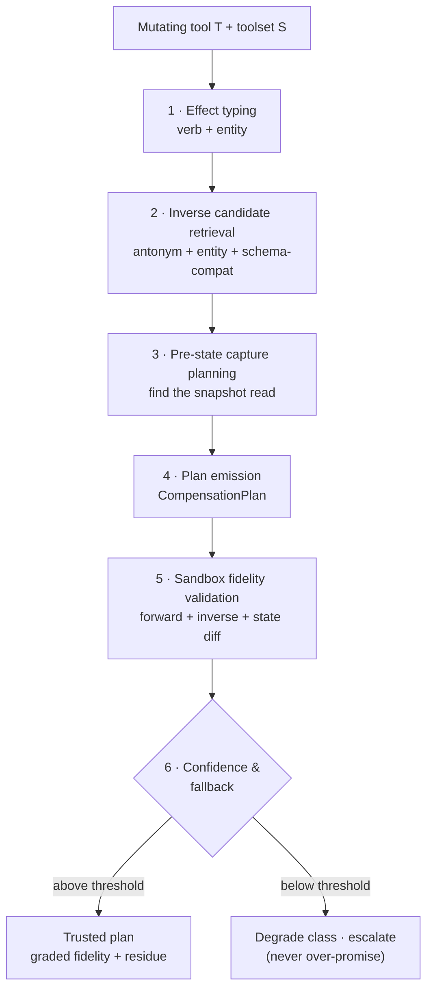

# Compensation synthesis

Classifying an action as reversible is only half the job. To actually *take it back*, Unwind must produce a concrete **inverse operation** for a tool nobody annotated for it. This is the compensation synthesiser — a six-stage pipeline that, given a mutating tool `T` and the full toolset `S` of its server, emits a `CompensationPlan` and, crucially, **validates it against a live sandbox** before trusting it.

!!! quote "The theory we stand on"
    In Garcia-Molina & Salem's Sagas (SIGMOD '87), a long-lived transaction decomposes into steps T₁…Tₙ each with a compensating step Cᵢ, and rollback runs Cⱼ…C₁ in reverse order — exactly the stack-unwinding metaphor Unwind is named for. The crucial nuance for our metrics: a compensating step undoes a transaction **semantically**; it restores *"an acceptable approximation,"* not necessarily exact prior state. **Rollback fidelity must therefore be graded, never bitwise.**

## The three non-negotiables

Before the pipeline, three rules govern every plan it emits:

1. **Fidelity is graded, never boolean.** Every plan carries a `fidelity_grade ∈ {exact, semantic, acceptable-approximation, failed}`. Unwind never reports "undo worked" as a single yes/no.
2. **Always report residue.** Some side effects survive any undo — a notification that already fired, an audit-log entry, a version-number bump, a webhook a third party already consumed. The plan lists them so the human knows exactly what the undo did *not* erase.
3. **Never over-promise reversibility.** A false undo guarantee is worse than no guarantee, because it manufactures the exact auto-approve reflex Unwind exists to cure. When confidence is low, the class is **degraded** (R2→R3) and the action **escalates** — Unwind declines to promise an undo it cannot stand behind.

## The pipeline



### Stage 1 — Effect typing

Classify `T`'s **effect verb** (`create` / `update` / `delete` / `send` / `execute` / `grant` / `revoke` / `move`) and its **target entity noun**, from the tool's name, description and JSON schema. An ensemble of lexical rules and an LLM classifier does the work; running the LLM with self-consistency over *k* samples yields a confidence signal for free.

### Stage 2 — Inverse candidate retrieval

Search the server's toolset `S` for a tool that undoes `T`, using three signals:

- **Verb-antonym matching** — `create ↔ delete`, `add ↔ remove`, `enable ↔ disable`, `grant ↔ revoke`, `archive ↔ restore`.
- **Entity-noun agreement** — the candidate must operate on the same kind of entity.
- **Parameter-schema compatibility** — does the candidate accept an identifier of the type `T` *returns*? This is the strongest signal, because it is **purely structural** and does not depend on natural language: if `create_page` returns a `page_id` and `delete_page` accepts a `page_id`, the pairing is mechanically plausible regardless of how either is described.

### Stage 3 — Pre-state capture planning

Identify the read tool that **snapshots the target entity before the mutation** — the `get_X` that matches `T`'s entity. This is what makes R1 reachable: without a viable snapshot, exact self-reversal is impossible and the class degrades. Pre-state capture is also how Unwind [pushes the commit point later](taxonomy.md#commit-point-semantics) — snapshotting *before* mutating converts an action that would have been R4 into R1/R2.

### Stage 4 — Plan emission

Emit a `CompensationPlan`:

```python
from unwind.types import CompensationPlan, FidelityGrade

plan = CompensationPlan(
    pre_read="get_page",              # snapshot before mutating (None ⇒ no R1)
    forward="update_page",            # the mutating tool this compensates
    inverse_tool="update_page",       # R1: the same tool restores prior state
    inverse_template={"page_id": "$forward.args.page_id",
                      "content": "$prestate.content"},
    expiry_s=None,                    # reversibility half-life for this plan
    fidelity_grade=FidelityGrade.FAILED,   # provisional until Stage 5 validates
    confidence=0.0,
    residue=[],
)
```

`inverse_template` binds its arguments from **captured pre-state** (`$prestate.*`) and the forward call's **response** (`$forward.*`). A plan is only *viable* if it names an inverse tool or has a pre-read to restore from.

### Stage 5 — Sandbox fidelity validation

!!! success "This is what makes it research, not heuristics"
    In an **isolated sandbox instance** of the real server, Unwind executes `pre_read → forward → inverse` and then **diffs the resulting state against the captured pre-state**. The plan's fidelity grade comes from that diff — from *actually running the inverse* — never from a model's assertion that it should work.

Fidelity is graded ordinally:

| Grade | Meaning |
|---|---|
| **exact** | Post-undo state is byte-identical to pre-state. |
| **semantic** | Key fields restored; incidental metadata (timestamps, version counters) may differ. |
| **acceptable-approximation** | Restored to an acceptable approximation per Garcia-Molina — the entity is functionally as it was. |
| **failed** | The inverse errored, or the diff shows the mutation was not undone. |

During validation Unwind also records **residue**: every observable side effect the inverse could *not* remove. Residue and fidelity are reported together — a "semantic" undo that fired three notifications is a very different thing from a clean one.

### Stage 6 — Confidence and fallback

Combine three inputs — structural-match strength (Stage 2), LLM agreement (Stage 1), and **validated fidelity** (Stage 5) — into a single calibrated confidence. Below the threshold, Unwind does **not** ship the plan as-is:

```python
# From unwind.types.Classification — degrade one step toward irreversible.
low_confidence = classification.degraded("sandbox fidelity only 'acceptable-approx' at p<0.6")
# An uncertain R2 becomes R3 and escalates, rather than promising a shaky undo.
```

This is the operational form of golden rule #3. The synthesiser would rather interrupt the human than hand back a compensation it cannot stand behind.

## What comes out

A trusted plan is attached to the action's `UndoEntry` in the [durable undo log](architecture.md#design-invariants), tagged with its fidelity grade, confidence, residue list, and expiry (its [half-life](taxonomy.md#reversibility-half-life-a-novel-dimension)). When the agent or a human calls [`unwind undo`](../agentic-tools.md#unwindundo), the plan's inverse template is bound against the stored pre-state and result, and executed in reverse order across every server.

The benchmark measures the synthesiser end to end — **coverage** (how many mutating tools get a candidate inverse), **validity** (how many inverses execute without error), **graded fidelity** (the distribution above, from the live sandbox), **residue rate**, and **half-life accuracy**. See [ReversiBench](../benchmark.md).
