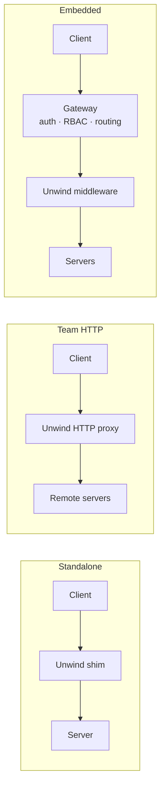

# Integrations

Unwind is built to slot into everything you already run. It runs standalone as a stdio shim, as an HTTP proxy, or embedded as middleware inside an existing gateway — and it complements those gateways rather than competing with them.

!!! quote "The positioning, in one line"
    **Gateways prevent. Unwind recovers.** Every MCP gateway is a preventive control — allow or block. Not one classifies reversibility, synthesises compensations, or can undo. Unwind is the reversibility layer that the whole category lacks, and it is shipped so it can live *inside* any of them.

## MCP clients

Wrap any upstream server with `unwind run -- <server command>` and point your client at Unwind. Full copy-paste configs for **Claude Desktop/Code, Cursor, VS Code, Cline, Windsurf, Goose, Zed and n8n** are in the [Quickstart](quickstart.md#3-configure-your-mcp-client). The minimal shape is always the same:

=== "pip"

    ```bash
    pip install unwind-mcp
    unwind run -- <your server command>
    ```

=== "npm"

    ```bash
    npm install -g unwind-mcp
    unwind run -- <your server command>
    ```

=== "docker"

    ```bash
    docker run --rm -i ghcr.io/bhaskargurram-ai/unwind:latest run -- <your server command>
    ```

Confirmations ride the client's [native MCP elicitation](concepts/architecture.md) surface, so there is nothing client-specific to install beyond the config line.

## MCP gateways — embed Unwind as middleware

Unwind ships as an embeddable middleware library so it can add **recovery** to a gateway's **prevention**. The pattern is identical everywhere: the gateway keeps owning auth/RBAC/routing; Unwind sits on the `tools/call` path, classifies, captures pre-state, logs to its own durable undo store, and elicits confirmation only for the irreversible minority.

| Gateway | What it does | How Unwind embeds |
|---|---|---|
| **Docker MCP Gateway** | Container isolation, signed images, secrets injection | Register Unwind as a call-path interceptor; the undo log persists in a mounted volume alongside the gateway's state. |
| **Stacklok ToolHive** | Cedar-policy authz, OIDC, audit logging | Run Unwind after ToolHive's Cedar decision — Cedar decides *allowed*, Unwind decides *reversible* and records the compensation. |
| **agentgateway** (Linux Foundation) | Routing/aggregation for agent traffic | Add Unwind as a filter in the request chain; route on the `Mcp-Method`/`Mcp-Name` headers so R0 reads skip the interceptor. |
| **IBM ContextForge** | MCP gateway + registry | Embed Unwind as a plugin on the tool-invocation hook; classifications come from the registry's cached catalog. |
| **MCPJungle** | Self-hosted MCP registry/proxy | Front upstream servers with Unwind in-process; the undo log is namespaced per registered server. |

!!! info "Why embedding, not competing"
    Auth, RBAC, rate limiting, secret scanning and container isolation are a **saturated** space and permanently [out of scope](faq.md) for Unwind. Turning those projects into distribution — a PR that adds Unwind as *optional* middleware — is a better strategy than reinventing their feature set. Unwind does the one thing none of them do.

## Deployment topologies



## Developer-service integrations

Unwind is wired into the standard open-source toolchain so the project is reproducible, citable and easy to contribute to. Concrete IDs, badges and DOIs are provisioned at launch and are **TBD** until then.

| Service | Role |
|---|---|
| **PyPI** — `unwind-mcp` | Python distribution; `pip install unwind-mcp`. |
| **npm** — `unwind-mcp` | Node stdio shim. |
| **GHCR** | Container images at `ghcr.io/bhaskargurram-ai/unwind`, published on tagged releases. |
| **Homebrew** | `brew install` tap for the CLI (TBD at launch). |
| **Codecov** | Coverage reporting; `eval/` coverage gate ≥80%. |
| **pre-commit.ci** | Auto-runs ruff + black + mypy hooks on every PR. |
| **Zenodo** | Archival DOI for tagged releases (DOI TBD). |
| **JOSS** | Journal of Open Source Software submission for the software artifact (TBD). |
| **Gitpod / GitHub Codespaces** | One-click dev environment from `.devcontainer/`. |

!!! note "No paid or network-dependent build steps"
    None of these services are required to build the docs or run the test suite locally. The documentation site builds fully offline from the `[docs]` extra.

## What Unwind will never integrate *as*

It will never be an auth provider, an RBAC engine, a rate limiter, a secret scanner, or a container sandbox. Those are the gateways' job, and doing them would dilute the one contribution that matters: **recovery**. See the [FAQ](faq.md#we-are-not-a-gateway) for the full out-of-scope list.
